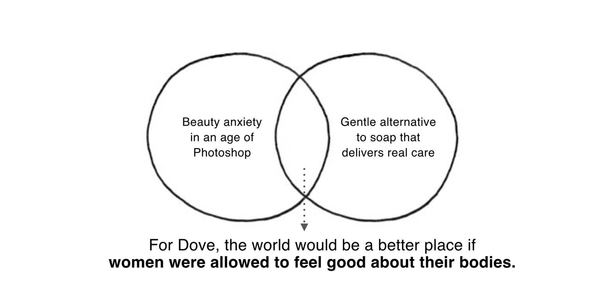
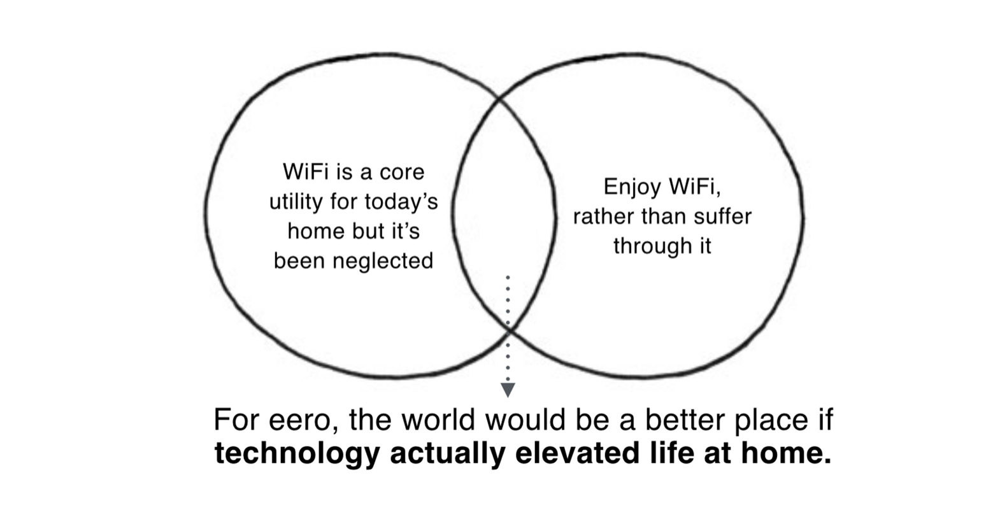

# Branding, marketing and positioning 

Referenced:
* Positioning Your Startup Is Vital—Here’s How to Nail It: https://review.firstround.com/Positioning-Your-Startup-is-Vital-Heres-How-to-Do-It-Right
* Three Moves Every Startup Founder Must Make to Build a Brand That Matters: https://review.firstround.com/three-moves-every-startup-founder-must-make-to-build-a-brand-that-matters
* What I Learned from Developing Branding for Airbnb, Dropbox, and Thumbtack: https://review.firstround.com/what-i-learned-from-developing-branding-for-airbnb-dropbox-and-thumbtack


## Positioning 
This conent comes from [Positioning Your Startup Is Vital—Here’s How to Nail It](https://review.firstround.com/Positioning-Your-Startup-is-Vital-Heres-How-to-Do-It-Right). 

Avoid buzzwords. 
> “People understand what's new and different by comparing it to something they already know." - [Positioning Your Startup Is Vital—Here’s How to Nail It](https://review.firstround.com/Positioning-Your-Startup-is-Vital-Heres-How-to-Do-It-Right)

### Framework

```
For (target customer) Who (statement of need or opportunity), (Product name) is a (product category) That (statement of key benefit). Unlike (competing alternative) (Product name)(statement of primary differentiation).
```

> For iOS mindfulness app users Who want to boost their happiness, Say Thanks More is a mindfulness app That reminds you to document and be grateful in your day. Unlike Stoic iOS App or the Mindfulness Apple Watch app, Say Thanks More has one single activity and reflection focus: gratitude.

### To prepare your positioning statement
Answering the following questions can help you get to a concrete statement. While answering these questions, avoid all buzzwords. If there’s one word that describes your positioning statement, it should be “human.”

* What’s different about the way your product/service works?
> It focuses on gratefulness and uses  mememnto mori to remind you that you have a limited number of days to be grateful.  


* Why do you do what you do?
> I want to help people enjoy more what they have so they take more care of their things and relationship and consume more thoughtfully and less compulsively.


* What is your broadest circle of prospective customers? Start with something like “Android users” or “people without cars,” and then try to get more specific, ending up with a profile of an individual model user.
> iOS / Apple Watch / Midfulness App

* What pain points are these customers experiencing? Be as clear and specific as possible. What emotions do customers associate with these pain points?
> In pursuit of what we want we sometimes forget what we have. We want to feel connected, be part of something larger than ourselves and have wonderful relationships. Being grateful is consistently associated with greater happiness, which helps people feel better, deal better with adversity and build stronger relationships.
> "In positive psychology research, gratitude is strongly and consistently associated with greater happiness. Gratitude helps people feel more positive emotions, relish good experiences, improve their health, deal with adversity, and build strong relationships." [Giving thanks can make you happier](https://www.health.harvard.edu/healthbeat/giving-thanks-can-make-you-happier)

* What other companies solve similar problems? Don’t just list your competitors but also their strengths and weaknesses compared to what you’re doing.
> [Stoic](https://www.getstoic.com) asks how are you feeling? It may be that in that precise moment you are not doing so well, but overall your day was fantastic. By focusing your attention of the things you are thankful for, Say Thanks More tries to take your feelings to a positive place. 

> Mindfulness asks you different questions during the day. This reflection exercises don't have a specific theme or let you document the reflections themselves. Say Thanks More focuses on one question that consistently correlates with happiness - what are you thankful for?

## How to Name Your Company

There are three routes you can take when it comes to naming:
* Descriptive: Fairly explicit about what your business is and does. Examples include Whole Foods, Toys "R" Us and PayPal.

* Suggestive: Evokes or suggests what your business or product is about, often via metaphor. Examples include Amazon, which suggests a giant river/huge selection, and Mint, where money is created.

* Fanciful: Has nothing directly to do with your company’s offering. Examples include Adobe and Apple.

According to Jackson, you should also ask yourself the following questions as you decide which one of these roads to go down:

1. What are the names of related or competitors' companies or products? You want to build differentiation into your name. Especially if you are launching into a space like online payments, you may want to steer clear of the word “pay,” because many companies have the word “pay” in their names, and it will be too hard for customers to remember you.

2. What brand values do you want to communicate? These might include words like simplicity, security, etc

3. Do you need the exact domain name to be available or can you get away with a verb-noun combination like many other companies have tried? Examples include squareup.com for Square, trycaviar.com for Caviar, and meetearnest.com for lending startup Earnest. These can work.

Second, take your written-out positioning statement and break it into nouns and verbs. For every meaningful word you can isolate, create a full list of [synonyms](http://www.thesaurus.com/). Once you have this list, you can try all kinds of different combinations.

* Real words: Repurposed words (Examples: Apple, Gain, Square)
* Compounds: Two words fused together (Salesforce, Facebook)
* Blends: Part of one word combined with part of another (Pinterest, Microsoft)
* Affixes: Tack something on like -er or -ly (Blogger, Contently)
* Truncations: Shorten a word or concept (Cisco is a clipped version of San Francisco)
* Other languages: Words that mean or suggest what you want to convey in other languages (Reebok, Asana). 

## How to Pull Together Branded Assets
To create a comprehensive brand, you need a logo, landing page, video, etc., and all that starts with something called a creative brief (1-2 pages max).

A comprehensive creative brief has the following components:
* Background: Your company or product name, a quick description of what it does and the value it creates, and a rough launch plan.

* Audience: Your target audience should be defined both by the demographics you are going after and a profile of your model customer (more on this later).

* Positioning: Your positioning statement with no frills.

* Competitive audit: A list of 5 to 10 companies that are playing in the same space, with your main competitor highlighted. You may also include single sentence descriptions of how they overlap with you and your business.

* Messaging: The key takeaways you want your audience to internalize about your product or company. This may also include your tagline if you have one (more on developing messaging below).

* Current perception: If you’re already in the market, how do people see you? What feelings do you produce in people? Try to be as objective as possible, including whether you want to change this perception.

* Brand attributes: A list of adjectives that you feel accurately describe the personality of your company.

* Inspiration: Any examples of brands, logos, verbiage, websites or advertising that you like. Explain very quickly what you like about them and/or what aspects you might like to see incorporated into your own creative work (clean font, an abstract logo, etc.). This can help provide some early direction.

* Deliverables: Do you just want a logo? Or a full brand identity with fonts, colors and brand guidelines? A website? A video? Define what you want to get out of the process, even if you’re running it on your own.

* Delivery date: Set a firm deadline for both concepts and final deliverables so you know you’re on track. Make sure the people doing the work agree to this timeline.

* Budget: Especially important if you’re working with external help, either a contractor, agency or creative firm. Do your best to stick to it.

* Sign off: Make it clear who has the authority to review and approve different deliverables. The buck should stop with one person.


## Creating a Brand
This content comes from [Three Moves Every Startup Founder Must Make to Build a Brand That Matters](https://review.firstround.com/three-moves-every-startup-founder-must-make-to-build-a-brand-that-matters).

A brand cements your position in your consumers’ minds and acts as an internal beacon for your company.

### Purpose
Your purpose is how you want to change the world for the better. The best way Jackson has found to define purpose is through an exercise from ad agency Ogilvy & Mather called [The big ideaL](http://www.ogilvy.com/On-Our-Minds/Articles/ThebigideaL2011.aspx). The big ideal is the intersection between cultural tension and a brand's best self.

1. Start by writing down all the elements that are cultural tensions for your company, 
2. as well as list all the ways your company delivers through its products and services. 

Your goal is to land on one primary statement for each circle. Taken together, they should help inform how you complete the following sentence:
```
“For your company, the world will be a better place if ________.”
```

Here is an example for Dove and eero.


